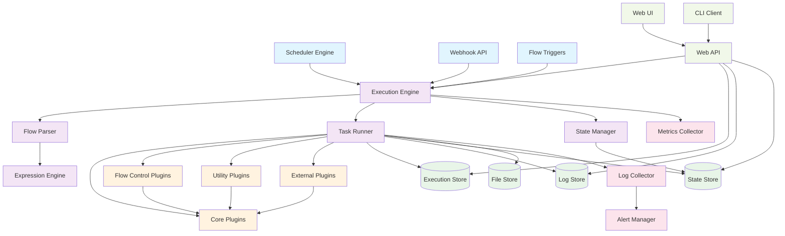
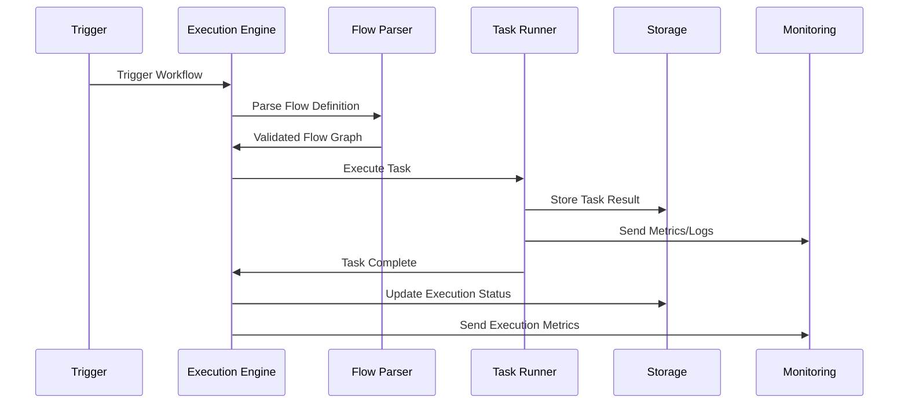
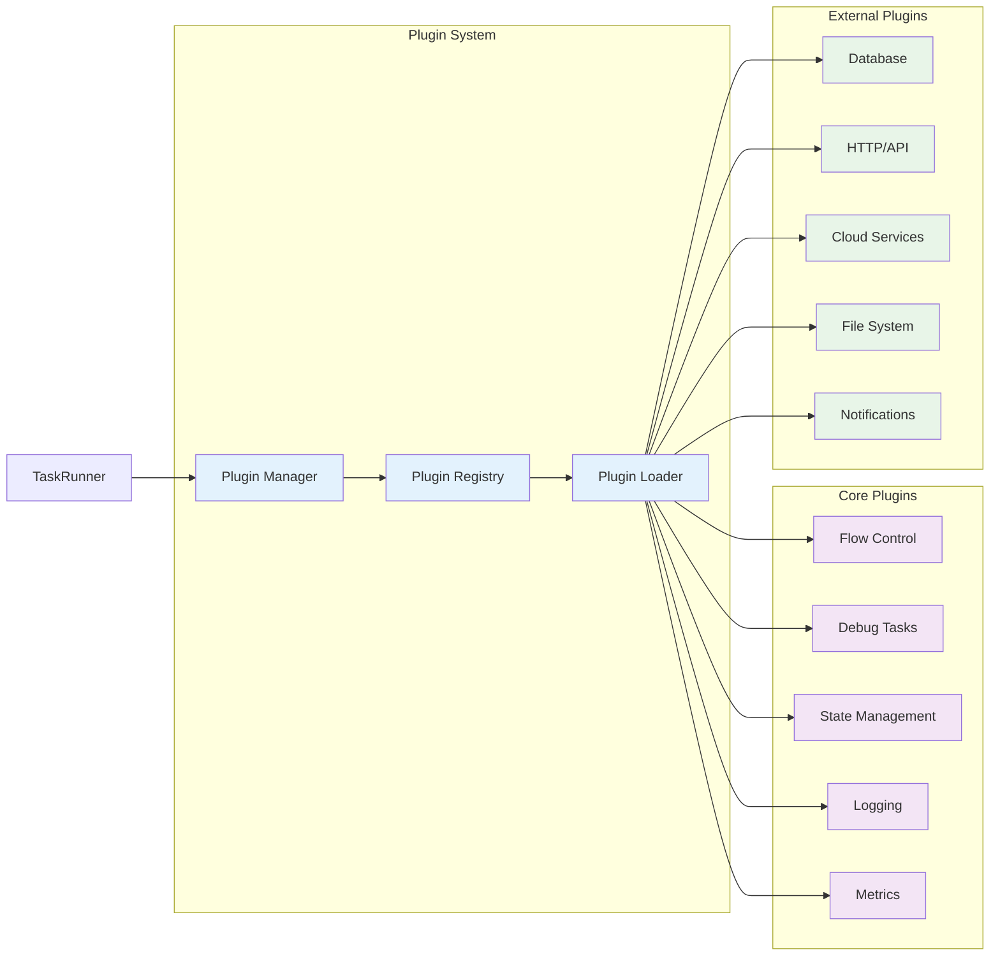

# Kestra Component Dependencies

## Component Descriptions

### Trigger Components
- **Scheduler Engine**: Manages cron-based and scheduled triggers
- **Webhook API**: Handles HTTP webhook triggers from external systems
- **Flow Triggers**: Manages workflow-to-workflow trigger relationships

### Core Engine Components
- **Execution Engine**: Orchestrates workflow execution and manages execution lifecycle
- **Task Runner**: Executes individual tasks and manages task state
- **Flow Parser**: Parses and validates YAML workflow definitions
- **Expression Engine**: Evaluates Pebble expressions and template rendering
- **State Manager**: Manages persistent state across workflow executions

### Storage Components
- **Execution Store**: Persists execution history, status, and metadata
- **Log Store**: Stores task and workflow execution logs
- **State Store**: Manages persistent state for workflows
- **File Store**: Handles file uploads, downloads, and working directories

### Plugin System
- **Core Plugins**: Essential flow control, debug, and utility tasks
- **Flow Control Plugins**: Sequential, parallel, conditional execution
- **Utility Plugins**: Logging, metrics, state management
- **External Plugins**: Database, API, cloud service integrations

### Monitoring and Observability
- **Metrics Collector**: Aggregates performance and execution metrics
- **Log Collector**: Centralizes log collection and processing
- **Alert Manager**: Handles notifications and alerting based on conditions

### API and Interfaces
- **Web API**: REST API for workflow management and execution
- **Web UI**: Browser-based interface for workflow development and monitoring
- **CLI Client**: Command-line interface for automation and scripting

## Data Flow

## Plugin Architecture

