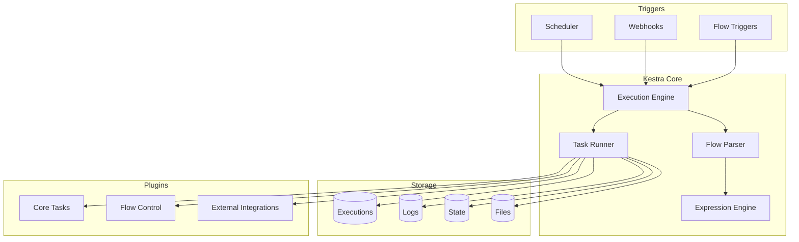

# Kestra Documentation Overview

This directory contains comprehensive documentation for Kestra workflow development, organized into logical components for better understanding and maintainability.

## Documentation Structure

### Core Documentation Files

#### 📖 Fundamental Concepts
- **[workflow-basics.txt](workflow-basics.txt)** - Core workflow structure, anatomy, and lifecycle
- **[inputs-and-expressions.txt](inputs-and-expressions.txt)** - Input types and Pebble expression language
- **[best-practices.txt](best-practices.txt)** - Comprehensive best practices and guidelines

#### 🔧 Task Documentation
- **[flow-control-tasks.txt](flow-control-tasks.txt)** - Sequential, parallel, conditional, and loop tasks
- **[utility-tasks.txt](utility-tasks.txt)** - Debug, logging, state management, and system tasks
- **[triggers-and-listeners.txt](triggers-and-listeners.txt)** - Event-driven execution and monitoring

#### 🏗️ Architecture
- **[component-dependencies.md](../component-dependencies.md)** - System architecture and component relationships

### Sample Workflows

#### 📊 Data Processing
- **[Basic Pipeline](../workflows/data-processing/basic-pipeline.md)** - Complete ETL pipeline with validation and error handling

#### 🔌 API Integration
- **[Polling Workflow](../workflows/api-integration/polling-workflow.md)** - API integration with polling, rate limiting, and circuit breaker patterns

#### 🚀 Deployment
- **[Environment Deployment](../workflows/deployment/environment-deployment.md)** - Multi-environment deployment with approval gates and rollback

#### 📈 Monitoring
- **[System Monitoring](../workflows/monitoring/system-monitoring.md)** - Comprehensive monitoring with automated alerting and incident response

## Quick Reference

### Essential Task Types

| Category | Task Type | Purpose |
|----------|-----------|---------|
| **Flow Control** | `Sequential` | Execute tasks in order |
| | `Parallel` | Execute tasks concurrently |
| | `ForEach` | Loop over collections |
| | `If` | Conditional execution |
| | `Switch` | Multi-way branching |
| **Utility** | `Debug.Return` | Output values for debugging |
| | `Log` | Structured logging |
| | `Sleep` | Introduce delays |
| | `Pause` | Manual approval points |
| **State** | `Set/Get/Delete` | Persistent state management |
| **Error Handling** | `AllowFailure` | Optional task execution |
| | `Assert` | Validation checks |
| | `Fail` | Force workflow failure |

### Common Expression Patterns

```yaml
# Input access
"{{inputs.parameter_name}}"

# Task output access
"{{outputs.task_id.property}}"

# Conditional logic
"{{inputs.environment == 'production'}}"

# Date operations
"{{now() | date('yyyy-MM-dd')}}"

# JSON processing
"{{inputs.config | json_path('$.database.host')}}"

# Default values
"{{inputs.optional_param ?? 'default_value'}}"
```

### Workflow Template

```yaml
id: workflow-name
namespace: organization.team
description: "Workflow purpose and functionality"

inputs:
  - id: required_param
    type: STRING
    description: "Parameter description"
  - id: optional_param
    type: INT
    defaults: 100

labels:
  environment: "production"
  team: "data-engineering"

tasks:
  - id: main-task
    type: io.kestra.plugin.core.debug.Return
    format: "Processing {{inputs.required_param}}"

triggers:
  - id: schedule
    type: io.kestra.plugin.core.trigger.Schedule
    cron: "0 2 * * *"

errors:
  - id: error-handler
    type: io.kestra.plugin.core.log.Log
    message: "Workflow failed: {{error.message}}"
    level: ERROR
```

## Architecture Overview



## Getting Started

1. **Start with basics**: Read [workflow-basics.txt](workflow-basics.txt) to understand core concepts
2. **Learn expressions**: Study [inputs-and-expressions.txt](inputs-and-expressions.txt) for dynamic workflows
3. **Explore tasks**: Review [flow-control-tasks.txt](flow-control-tasks.txt) and [utility-tasks.txt](utility-tasks.txt)
4. **Study examples**: Examine sample workflows in the `workflows/` directory
5. **Follow best practices**: Implement guidelines from [best-practices.txt](best-practices.txt)

## Development Workflow

1. **Plan**: Define workflow requirements and data flow
2. **Design**: Choose appropriate task types and flow control
3. **Implement**: Write YAML with proper error handling
4. **Test**: Validate with different input scenarios
5. **Deploy**: Follow environment-specific deployment patterns
6. **Monitor**: Implement logging and alerting

## Support and Resources

- **Documentation**: This structured documentation set
- **Examples**: Real-world workflow patterns in `workflows/` subdirectories
- **Best Practices**: Comprehensive guidelines for production workflows
- **Architecture**: Component relationships and system design

For specific use cases, refer to the appropriate workflow example in the `workflows/` directory, which includes both YAML definitions and visual mermaid diagrams explaining the execution flow.