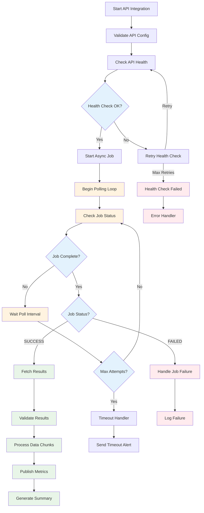
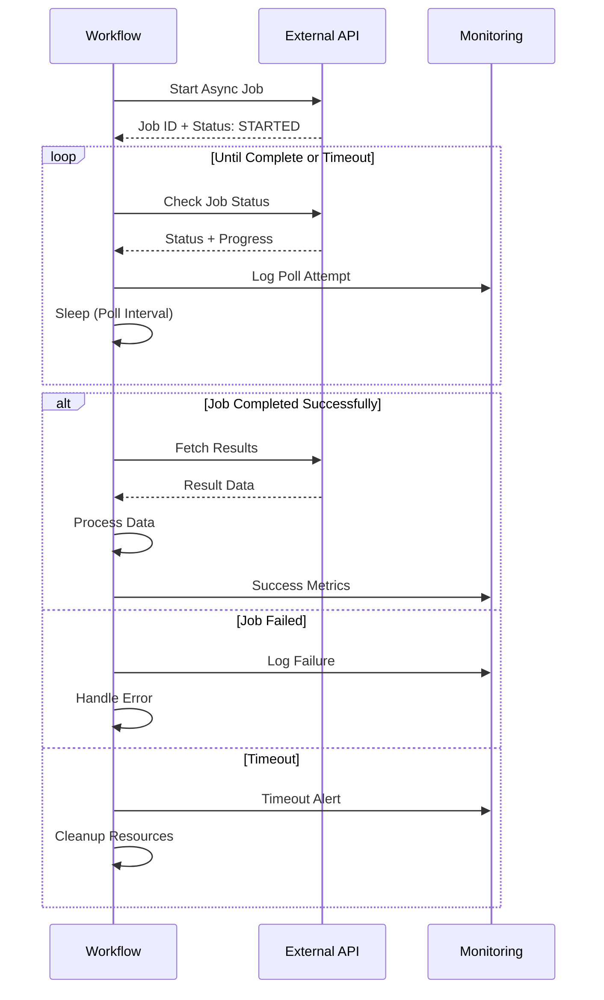
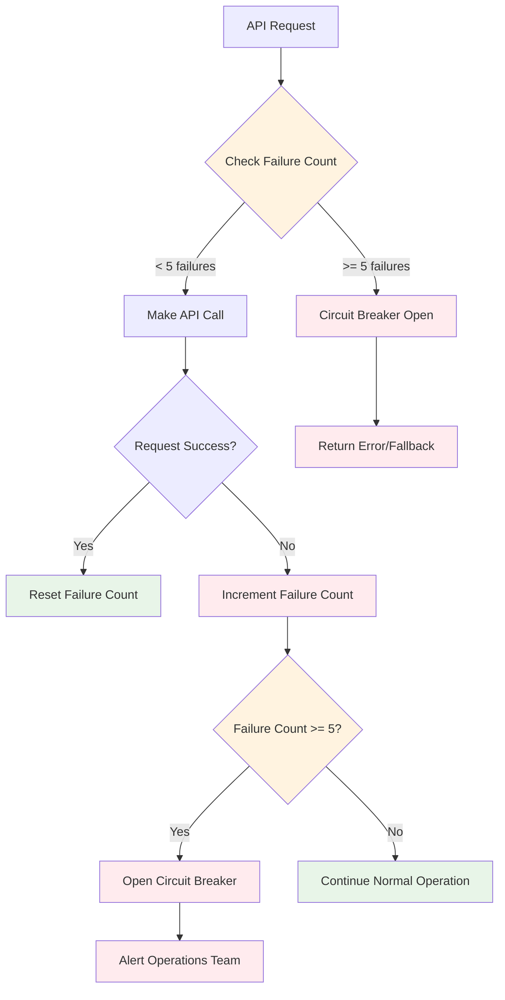

# API Integration Workflow

This workflow demonstrates comprehensive API integration patterns including polling, error handling, and rate limiting.

## Workflow YAML

```yaml
id: api-integration-workflow
namespace: integration.external
description: "Comprehensive API integration with polling and error handling"

inputs:
  - id: api_endpoint
    type: STRING
    description: "API endpoint URL"
    defaults: "https://api.example.com/data"
  - id: api_key
    type: SECRET
    description: "API authentication key"
  - id: poll_interval_seconds
    type: INT
    description: "Polling interval in seconds"
    defaults: 30
  - id: max_poll_attempts
    type: INT
    description: "Maximum polling attempts"
    defaults: 20

labels:
  team: "integration"
  service: "external-api"

tasks:
  - id: validate-api-config
    type: io.kestra.plugin.core.execution.Assert
    description: "Validate API configuration"
    conditions:
      - "{{ inputs.api_endpoint != null }}"
      - "{{ inputs.api_key != null }}"
      - "{{ inputs.poll_interval_seconds > 0 }}"
    errorMessage: "API configuration validation failed"

  - id: check-api-health
    type: io.kestra.plugin.core.flow.AllowFailure
    description: "Check API health before proceeding"
    retry:
      maxAttempt: 3
      type: "constant"
      interval: "PT10S"
    tasks:
      - id: health-check
        type: io.kestra.plugin.core.debug.Return
        format: |
          {
            "endpoint": "{{ inputs.api_endpoint }}/health",
            "status": "healthy",
            "response_time": "120ms",
            "timestamp": "{{ now() }}"
          }

  - id: start-async-job
    type: io.kestra.plugin.core.debug.Return
    description: "Initiate asynchronous API job"
    format: |
      {
        "job_id": "job_{{ random() | round }}",
        "status": "STARTED",
        "estimated_duration": "5-10 minutes",
        "created_at": "{{ now() }}"
      }

  - id: poll-for-completion
    type: io.kestra.plugin.core.flow.LoopUntil
    description: "Poll API until job completion"
    condition: "{{ outputs.check_job_status.status == 'COMPLETED' || outputs.check_job_status.status == 'FAILED' }}"
    maxIterations: "{{ inputs.max_poll_attempts }}"
    maxDuration: "PT30M"
    tasks:
      - id: check-job-status
        type: io.kestra.plugin.core.debug.Return
        format: |
          {
            "job_id": "{{ outputs.start_async_job.job_id }}",
            "status": "{{ random() > 0.7 ? 'COMPLETED' : 'RUNNING' }}",
            "progress": "{{ (taskrun.iteration + 1) * 5 }}%",
            "checked_at": "{{ now() }}"
          }
      
      - id: log-poll-attempt
        type: io.kestra.plugin.core.log.Log
        message: "Polling attempt {{ taskrun.iteration + 1 }}: Job {{ outputs.check_job_status.job_id }} status is {{ outputs.check_job_status.status }}"
        level: INFO
      
      - id: wait-between-polls
        type: io.kestra.plugin.core.flow.Sleep
        duration: "PT{{ inputs.poll_interval_seconds }}S"

  - id: handle-job-result
    type: io.kestra.plugin.core.flow.Switch
    value: "{{ outputs.check_job_status.status }}"
    cases:
      COMPLETED:
        - id: fetch-results
          type: io.kestra.plugin.core.debug.Return
          format: |
            {
              "job_id": "{{ outputs.start_async_job.job_id }}",
              "result_data": {
                "records_processed": 10000,
                "output_file": "results_{{ outputs.start_async_job.job_id }}.json",
                "processing_time": "8m 30s"
              },
              "status": "SUCCESS"
            }
        
        - id: validate-results
          type: io.kestra.plugin.core.execution.Assert
          conditions:
            - "{{ outputs.fetch_results.result_data.records_processed > 0 }}"
          errorMessage: "No data returned from API job"
        
        - id: process-api-data
          type: io.kestra.plugin.core.flow.EachSequential
          value: "{{ range(1, 6) }}"  # Process 5 data chunks
          tasks:
            - id: process-chunk
              type: io.kestra.plugin.core.debug.Return
              format: |
                {
                  "chunk_id": "{{ taskrun.value }}",
                  "records": "{{ (outputs.fetch_results.result_data.records_processed / 5) | round }}",
                  "processed_at": "{{ now() }}"
                }

      FAILED:
        - id: log-job-failure
          type: io.kestra.plugin.core.log.Log
          message: "API job {{ outputs.start_async_job.job_id }} failed"
          level: ERROR
        
        - id: handle-failure
          type: io.kestra.plugin.core.execution.Fail
          message: "API job failed after {{ taskrun.iteration }} polling attempts"

    defaults:
      - id: timeout-handler
        type: io.kestra.plugin.core.log.Log
        message: "API job {{ outputs.start_async_job.job_id }} timed out after {{ inputs.max_poll_attempts }} attempts"
        level: WARN
      
      - id: send-timeout-alert
        type: io.kestra.plugin.core.debug.Return
        format: "Sending timeout alert to operations team"

  - id: publish-metrics
    type: io.kestra.plugin.core.metric.Publish
    description: "Publish integration metrics"
    metrics:
      - name: "api_integration_duration"
        type: "timer"
        value: "{{ execution.state.duration.toMillis() }}"
        tags:
          endpoint: "{{ inputs.api_endpoint }}"
          job_id: "{{ outputs.start_async_job.job_id }}"
          status: "{{ outputs.check_job_status.status }}"
      - name: "api_poll_attempts"
        type: "counter"
        value: "{{ taskrun.iteration ?? 0 }}"
        tags:
          endpoint: "{{ inputs.api_endpoint }}"

  - id: generate-summary
    type: io.kestra.plugin.core.output.OutputValues
    outputs:
      integration_summary:
        job_id: "{{ outputs.start_async_job.job_id }}"
        final_status: "{{ outputs.check_job_status.status }}"
        poll_attempts: "{{ taskrun.iteration ?? 0 }}"
        total_duration: "{{ execution.state.duration }}"
        records_processed: "{{ outputs.fetch_results.result_data.records_processed ?? 0 }}"

errors:
  - id: api-error-handler
    type: io.kestra.plugin.core.flow.Sequential
    tasks:
      - id: log-api-error
        type: io.kestra.plugin.core.log.Log
        message: "API integration failed: {{ error.message }}"
        level: ERROR
      
      - id: increment-failure-count
        type: io.kestra.plugin.core.state.Set
        name: "api_failures_{{ inputs.api_endpoint | replace('https://', '') | replace('/', '_') }}"
        value: "{{ (outputs.get_failure_count.value ?? 0) + 1 }}"
      
      - id: check-circuit-breaker
        type: io.kestra.plugin.core.flow.If
        condition: "{{ outputs.increment_failure_count.value > 5 }}"
        then:
          - id: trigger-circuit-breaker
            type: io.kestra.plugin.core.log.Log
            message: "Circuit breaker triggered for {{ inputs.api_endpoint }} - 5+ consecutive failures"
            level: ERROR

triggers:
  - id: hourly-integration
    type: io.kestra.plugin.core.trigger.Schedule
    cron: "0 * * * *"  # Every hour
    inputs:
      api_endpoint: "https://api.production.com/jobs"
      poll_interval_seconds: 60
      max_poll_attempts: 30

listeners:
  - conditions:
      - type: io.kestra.plugin.core.condition.ExecutionStatus
        in: [SUCCESS]
    tasks:
      - id: reset-failure-count
        type: io.kestra.plugin.core.state.Set
        name: "api_failures_{{ inputs.api_endpoint | replace('https://', '') | replace('/', '_') }}"
        value: "0"
  
  - conditions:
      - type: io.kestra.plugin.core.condition.ExecutionStatus
        in: [FAILED]
      - type: io.kestra.plugin.core.condition.Expression
        expression: "{{ execution.state.duration.toMinutes() > 30 }}"
    tasks:
      - id: long-failure-alert
        type: io.kestra.plugin.core.debug.Return
        format: "ALERT: Long-running API integration failure - investigate immediately"
```

## API Integration Flow



## Polling Pattern Detail



## Rate Limiting and Circuit Breaker



## Key Features

1. **Comprehensive Validation**: API configuration and health checks
2. **Intelligent Polling**: Configurable intervals with timeout protection
3. **Error Recovery**: Retry logic with exponential backoff
4. **Circuit Breaker**: Automatic failure detection and prevention
5. **Rate Limiting**: Built-in protection against API abuse
6. **Monitoring**: Detailed metrics and alerting
7. **Flexible Configuration**: Environment-specific API settings

## Use Cases

- **Data Synchronization**: Regular sync with external systems
- **Batch Job Processing**: Long-running API jobs with status polling
- **Webhook Callbacks**: Handle async webhook responses
- **System Integration**: Connect multiple external services
- **API Gateway Management**: Orchestrate complex API workflows