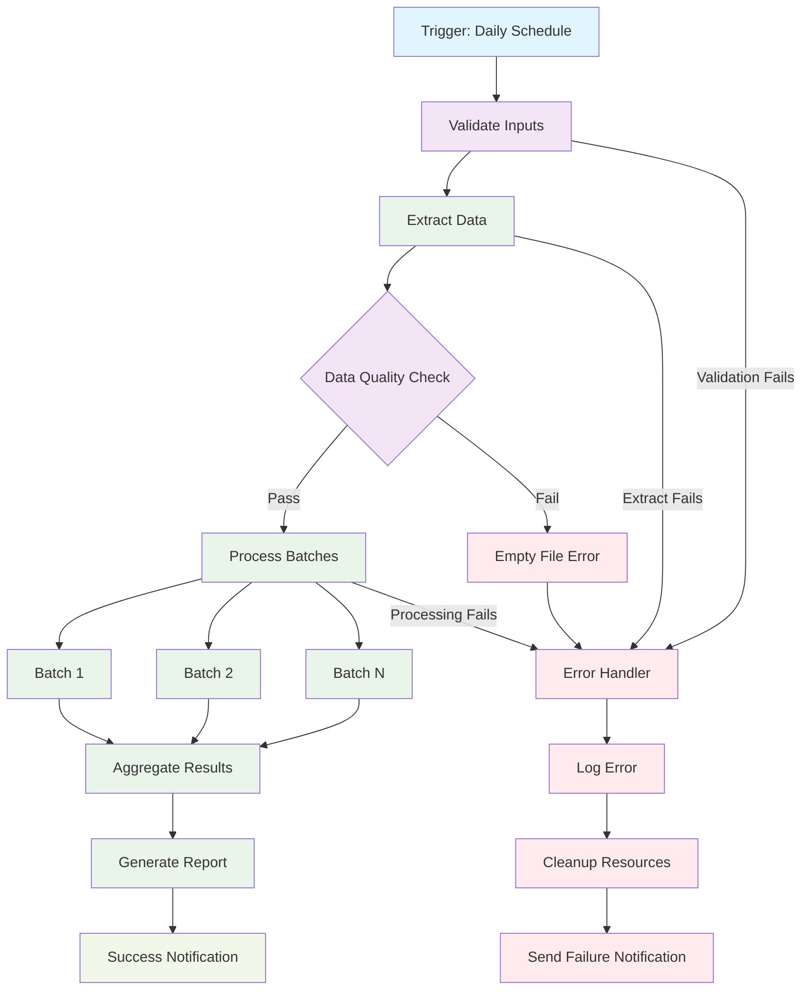
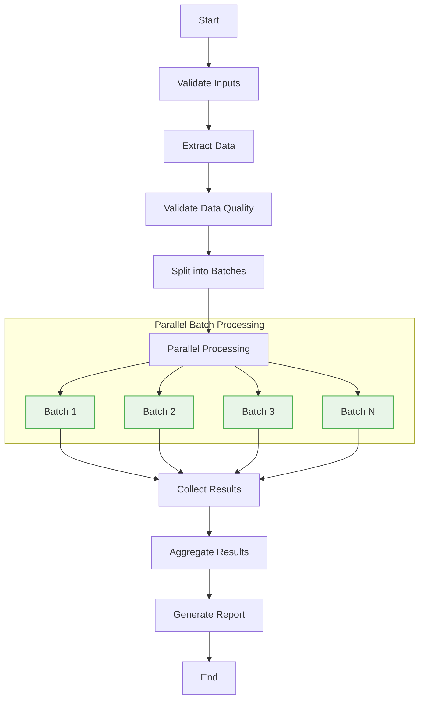

# Data Processing Pipeline

This workflow demonstrates a complete data processing pipeline with validation, transformation, and error handling.

## Workflow YAML

```yaml
id: data-processing-pipeline
namespace: data.engineering
description: "Complete data processing pipeline with validation and error handling"

inputs:
  - id: source_file
    type: FILE
    description: "Source data file to process"
  - id: batch_size
    type: INT
    description: "Number of records to process in each batch"
    defaults: 1000
  - id: environment
    type: STRING
    description: "Target environment"
    defaults: "dev"

labels:
  team: "data-engineering"
  criticality: "medium"

tasks:
  - id: validate-inputs
    type: io.kestra.plugin.core.execution.Assert
    description: "Validate required inputs are present"
    conditions:
      - "{{ inputs.source_file != null }}"
      - "{{ inputs.batch_size > 0 }}"
      - "{{ inputs.environment in ['dev', 'staging', 'production'] }}"
    errorMessage: "Input validation failed - check required parameters"

  - id: extract-data
    type: io.kestra.plugin.core.debug.Return
    description: "Extract data from source file"
    format: |
      {
        "source": "{{inputs.source_file}}",
        "records_found": 5000,
        "file_size": "25MB",
        "format": "CSV"
      }

  - id: validate-data-quality
    type: io.kestra.plugin.core.flow.If
    condition: "{{ outputs.extract_data.records_found > 0 }}"
    then:
      - id: quality-check
        type: io.kestra.plugin.core.debug.Return
        format: |
          {
            "quality_score": 0.95,
            "null_count": 50,
            "duplicate_count": 10,
            "status": "PASSED"
          }
    else:
      - id: empty-file-error
        type: io.kestra.plugin.core.execution.Fail
        message: "No data found in source file"

  - id: process-batches
    type: io.kestra.plugin.core.flow.ForEach
    values: "{{ range(0, (outputs.extract_data.records_found / inputs.batch_size) | round) }}"
    tasks:
      - id: process-batch
        type: io.kestra.plugin.core.debug.Return
        format: |
          {
            "batch_id": "{{taskrun.value}}",
            "start_record": "{{ taskrun.value * inputs.batch_size }}",
            "end_record": "{{ (taskrun.value + 1) * inputs.batch_size }}",
            "processed_records": "{{inputs.batch_size}}",
            "status": "SUCCESS"
          }

  - id: aggregate-results
    type: io.kestra.plugin.core.debug.Return
    description: "Aggregate processing results"
    format: |
      {
        "total_batches": "{{ outputs.process_batches | length }}",
        "total_records": "{{ outputs.extract_data.records_found }}",
        "processing_time": "{{ execution.state.duration }}",
        "environment": "{{ inputs.environment }}",
        "status": "COMPLETED"
      }

  - id: generate-report
    type: io.kestra.plugin.core.output.OutputValues
    outputs:
      processing_summary:
        total_records: "{{ outputs.extract_data.records_found }}"
        batches_processed: "{{ outputs.process_batches | length }}"
        quality_score: "{{ outputs.quality_check.quality_score }}"
        duration: "{{ execution.state.duration }}"
        environment: "{{ inputs.environment }}"

errors:
  - id: error-handler
    type: io.kestra.plugin.core.flow.Sequential
    tasks:
      - id: log-error
        type: io.kestra.plugin.core.log.Log
        message: "Data processing failed: {{ error.message }}"
        level: ERROR
      - id: cleanup-resources
        type: io.kestra.plugin.core.debug.Return
        format: "Cleaning up temporary resources"
      - id: send-failure-notification
        type: io.kestra.plugin.core.debug.Return
        format: "Sending failure notification to team"

triggers:
  - id: daily-processing
    type: io.kestra.plugin.core.trigger.Schedule
    cron: "0 2 * * *"  # Daily at 2 AM
    inputs:
      environment: "production"
      batch_size: 5000

listeners:
  - conditions:
      - type: io.kestra.plugin.core.condition.ExecutionStatus
        in: [SUCCESS]
    tasks:
      - id: success-notification
        type: io.kestra.plugin.core.log.Log
        message: "Data processing completed successfully - processed {{ outputs.aggregate_results.total_records }} records"
        level: INFO
```

## Workflow Execution Flow



## Parallel Processing Variant



## Key Features

1. **Input Validation**: Comprehensive validation of required parameters
2. **Data Quality Checks**: Validate data before processing
3. **Batch Processing**: Process large datasets in manageable chunks
4. **Error Handling**: Global error handlers with cleanup and notifications
5. **Monitoring**: Success/failure notifications and detailed logging
6. **Flexible Configuration**: Environment-specific settings and batch sizes
7. **Comprehensive Reporting**: Detailed processing metrics and summaries

## Use Cases

- **ETL Pipelines**: Extract, transform, and load data from various sources
- **Data Validation**: Quality checks and data profiling workflows
- **Batch Processing**: Large dataset processing with parallel execution
- **Report Generation**: Automated reporting from processed data
- **Data Migration**: Moving data between systems with validation