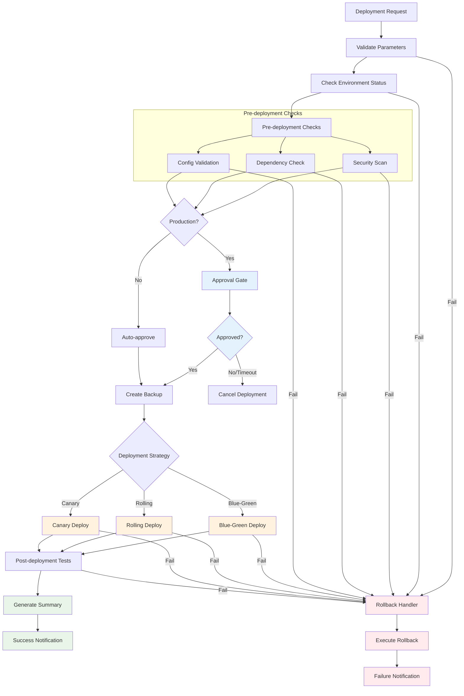
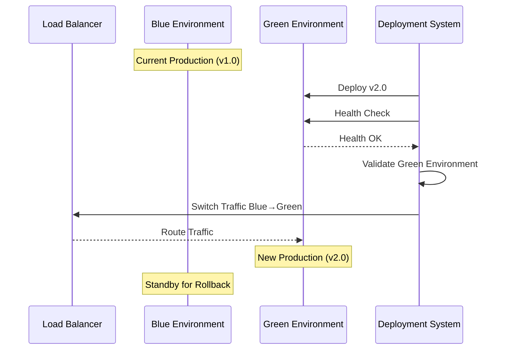
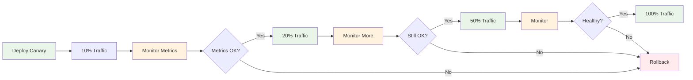

# Environment-Aware Deployment Workflow

This workflow demonstrates environment-specific deployment patterns with approval gates and rollback capabilities.

## Workflow YAML

```yaml
id: environment-deployment
namespace: deployment.pipeline
description: "Multi-environment deployment with approval gates and rollback"

inputs:
  - id: application_name
    type: STRING
    description: "Name of the application to deploy"
  - id: version
    type: STRING
    description: "Version to deploy"
  - id: target_environment
    type: STRING
    description: "Target deployment environment"
    defaults: "staging"
  - id: deployment_strategy
    type: STRING
    description: "Deployment strategy (blue-green, rolling, canary)"
    defaults: "rolling"
  - id: skip_approval
    type: BOOLEAN
    description: "Skip manual approval for non-production environments"
    defaults: false

labels:
  team: "platform"
  application: "{{ inputs.application_name }}"
  version: "{{ inputs.version }}"

tasks:
  - id: validate-deployment-request
    type: io.kestra.plugin.core.execution.Assert
    description: "Validate deployment parameters"
    conditions:
      - "{{ inputs.application_name != null }}"
      - "{{ inputs.version != null }}"
      - "{{ inputs.target_environment in ['dev', 'staging', 'production'] }}"
      - "{{ inputs.deployment_strategy in ['blue-green', 'rolling', 'canary'] }}"
    errorMessage: "Invalid deployment parameters"

  - id: check-environment-status
    type: io.kestra.plugin.core.debug.Return
    description: "Check target environment health"
    format: |
      {
        "environment": "{{ inputs.target_environment }}",
        "status": "healthy",
        "capacity": "85%",
        "last_deployment": "2024-01-15T10:30:00Z",
        "maintenance_window": false
      }

  - id: verify-environment-capacity
    type: io.kestra.plugin.core.flow.If
    condition: "{{ outputs.check_environment_status.capacity | replace('%', '') | int < 90 }}"
    then:
      - id: capacity-ok
        type: io.kestra.plugin.core.log.Log
        message: "Environment capacity OK: {{ outputs.check_environment_status.capacity }}"
        level: INFO
    else:
      - id: capacity-warning
        type: io.kestra.plugin.core.log.Log
        message: "WARNING: High environment capacity {{ outputs.check_environment_status.capacity }}"
        level: WARN

  - id: pre-deployment-checks
    type: io.kestra.plugin.core.flow.Parallel
    tasks:
      - id: security-scan
        type: io.kestra.plugin.core.debug.Return
        format: |
          {
            "scan_type": "security",
            "vulnerabilities": 0,
            "status": "PASSED",
            "score": "A+",
            "scanned_at": "{{ now() }}"
          }
      
      - id: dependency-check
        type: io.kestra.plugin.core.debug.Return
        format: |
          {
            "scan_type": "dependencies",
            "outdated_packages": 2,
            "critical_vulnerabilities": 0,
            "status": "PASSED",
            "scanned_at": "{{ now() }}"
          }
      
      - id: configuration-validation
        type: io.kestra.plugin.core.debug.Return
        format: |
          {
            "config_files": ["app.yml", "database.yml", "secrets.yml"],
            "validation_status": "PASSED",
            "environment": "{{ inputs.target_environment }}",
            "validated_at": "{{ now() }}"
          }

  - id: approval-gate
    type: io.kestra.plugin.core.flow.If
    condition: "{{ inputs.target_environment == 'production' && !inputs.skip_approval }}"
    then:
      - id: request-production-approval
        type: io.kestra.plugin.core.flow.Pause
        timeout: "PT2H"  # 2 hour timeout for approval
        onTimeout:
          - id: approval-timeout
            type: io.kestra.plugin.core.log.Log
            message: "Production deployment approval timed out"
            level: WARN
          - id: send-timeout-notification
            type: io.kestra.plugin.core.debug.Return
            format: "Sending approval timeout notification to ops team"
      
      - id: log-approval-granted
        type: io.kestra.plugin.core.log.Log
        message: "Production deployment approved for {{ inputs.application_name }} v{{ inputs.version }}"
        level: INFO
    else:
      - id: auto-approved
        type: io.kestra.plugin.core.log.Log
        message: "Auto-approved deployment to {{ inputs.target_environment }}"
        level: INFO

  - id: backup-current-version
    type: io.kestra.plugin.core.flow.If
    condition: "{{ inputs.target_environment == 'production' }}"
    then:
      - id: create-backup
        type: io.kestra.plugin.core.debug.Return
        format: |
          {
            "backup_id": "backup_{{ now() | date('yyyyMMdd_HHmmss') }}",
            "application": "{{ inputs.application_name }}",
            "current_version": "v1.2.3",
            "backup_location": "/backups/{{ inputs.application_name }}/",
            "created_at": "{{ now() }}"
          }
    else:
      - id: skip-backup
        type: io.kestra.plugin.core.log.Log
        message: "Skipping backup for non-production environment"
        level: INFO

  - id: execute-deployment
    type: io.kestra.plugin.core.flow.Switch
    value: "{{ inputs.deployment_strategy }}"
    cases:
      blue-green:
        - id: blue-green-deployment
          type: io.kestra.plugin.core.flow.Sequential
          tasks:
            - id: deploy-to-green
              type: io.kestra.plugin.core.debug.Return
              format: |
                {
                  "strategy": "blue-green",
                  "target_slot": "green",
                  "application": "{{ inputs.application_name }}",
                  "version": "{{ inputs.version }}",
                  "status": "DEPLOYED"
                }
            
            - id: health-check-green
              type: io.kestra.plugin.core.flow.LoopUntil
              condition: "{{ outputs.check_green_health.status == 'healthy' }}"
              maxIterations: 10
              maxDuration: "PT10M"
              tasks:
                - id: check-green-health
                  type: io.kestra.plugin.core.debug.Return
                  format: |
                    {
                      "slot": "green",
                      "status": "{{ random() > 0.3 ? 'healthy' : 'starting' }}",
                      "response_time": "{{ (random() * 100) | round }}ms",
                      "checked_at": "{{ now() }}"
                    }
                - id: wait-for-health
                  type: io.kestra.plugin.core.flow.Sleep
                  duration: "PT30S"
            
            - id: switch-traffic
              type: io.kestra.plugin.core.debug.Return
              format: |
                {
                  "action": "traffic_switch",
                  "from": "blue",
                  "to": "green",
                  "application": "{{ inputs.application_name }}",
                  "switched_at": "{{ now() }}"
                }

      rolling:
        - id: rolling-deployment
          type: io.kestra.plugin.core.flow.Sequential
          tasks:
            - id: deploy-instances
              type: io.kestra.plugin.core.flow.EachSequential
              value: "{{ range(1, 4) }}"  # Deploy to 3 instances
              tasks:
                - id: deploy-instance
                  type: io.kestra.plugin.core.debug.Return
                  format: |
                    {
                      "strategy": "rolling",
                      "instance": "{{ taskrun.value }}",
                      "application": "{{ inputs.application_name }}",
                      "version": "{{ inputs.version }}",
                      "status": "DEPLOYED"
                    }
                
                - id: health-check-instance
                  type: io.kestra.plugin.core.debug.Return
                  format: |
                    {
                      "instance": "{{ taskrun.value }}",
                      "health": "healthy",
                      "version": "{{ inputs.version }}",
                      "checked_at": "{{ now() }}"
                    }
                
                - id: wait-between-instances
                  type: io.kestra.plugin.core.flow.Sleep
                  duration: "PT1M"

      canary:
        - id: canary-deployment
          type: io.kestra.plugin.core.flow.Sequential
          tasks:
            - id: deploy-canary
              type: io.kestra.plugin.core.debug.Return
              format: |
                {
                  "strategy": "canary",
                  "traffic_percentage": 10,
                  "application": "{{ inputs.application_name }}",
                  "version": "{{ inputs.version }}",
                  "status": "CANARY_DEPLOYED"
                }
            
            - id: monitor-canary
              type: io.kestra.plugin.core.flow.LoopUntil
              condition: "{{ taskrun.iteration >= 5 }}"  # Monitor for 5 iterations
              maxIterations: 10
              tasks:
                - id: check-canary-metrics
                  type: io.kestra.plugin.core.debug.Return
                  format: |
                    {
                      "error_rate": "{{ (random() * 0.01) | round(4) }}",
                      "response_time": "{{ (random() * 50 + 100) | round }}ms",
                      "throughput": "{{ (random() * 100 + 500) | round }}rps",
                      "status": "{{ outputs.check_canary_metrics.error_rate < 0.005 ? 'healthy' : 'degraded' }}"
                    }
                - id: wait-monitoring
                  type: io.kestra.plugin.core.flow.Sleep
                  duration: "PT2M"
            
            - id: promote-canary
              type: io.kestra.plugin.core.debug.Return
              format: |
                {
                  "action": "promote_canary",
                  "traffic_percentage": 100,
                  "application": "{{ inputs.application_name }}",
                  "version": "{{ inputs.version }}",
                  "promoted_at": "{{ now() }}"
                }

  - id: post-deployment-verification
    type: io.kestra.plugin.core.flow.Parallel
    tasks:
      - id: smoke-tests
        type: io.kestra.plugin.core.debug.Return
        format: |
          {
            "test_type": "smoke",
            "tests_run": 15,
            "tests_passed": 15,
            "tests_failed": 0,
            "status": "PASSED"
          }
      
      - id: integration-tests
        type: io.kestra.plugin.core.debug.Return
        format: |
          {
            "test_type": "integration",
            "tests_run": 8,
            "tests_passed": 8,
            "tests_failed": 0,
            "status": "PASSED"
          }
      
      - id: performance-baseline
        type: io.kestra.plugin.core.debug.Return
        format: |
          {
            "test_type": "performance",
            "avg_response_time": "125ms",
            "throughput": "750rps",
            "error_rate": "0.001%",
            "status": "BASELINE_MET"
          }

  - id: deployment-summary
    type: io.kestra.plugin.core.output.OutputValues
    outputs:
      deployment_result:
        application: "{{ inputs.application_name }}"
        version: "{{ inputs.version }}"
        environment: "{{ inputs.target_environment }}"
        strategy: "{{ inputs.deployment_strategy }}"
        duration: "{{ execution.state.duration }}"
        backup_id: "{{ outputs.create_backup.backup_id ?? 'none' }}"
        tests_status: "{{ outputs.smoke_tests.status }}"
        final_status: "SUCCESS"

errors:
  - id: deployment-rollback
    type: io.kestra.plugin.core.flow.Sequential
    tasks:
      - id: log-deployment-failure
        type: io.kestra.plugin.core.log.Log
        message: "Deployment failed: {{ error.message }}"
        level: ERROR
      
      - id: initiate-rollback
        type: io.kestra.plugin.core.flow.If
        condition: "{{ inputs.target_environment == 'production' && outputs.create_backup.backup_id != null }}"
        then:
          - id: execute-rollback
            type: io.kestra.plugin.core.debug.Return
            format: |
              {
                "action": "rollback",
                "backup_id": "{{ outputs.create_backup.backup_id }}",
                "application": "{{ inputs.application_name }}",
                "rolled_back_at": "{{ now() }}"
              }
          
          - id: verify-rollback
            type: io.kestra.plugin.core.debug.Return
            format: |
              {
                "rollback_status": "SUCCESS",
                "application": "{{ inputs.application_name }}",
                "environment": "{{ inputs.target_environment }}",
                "verified_at": "{{ now() }}"
              }
        else:
          - id: manual-intervention-required
            type: io.kestra.plugin.core.log.Log
            message: "Manual intervention required - no automated rollback available"
            level: WARN

triggers:
  - id: webhook-deployment
    type: io.kestra.plugin.core.trigger.Webhook
    key: "deploy-webhook"

listeners:
  - conditions:
      - type: io.kestra.plugin.core.condition.ExecutionStatus
        in: [SUCCESS]
    tasks:
      - id: success-notification
        type: io.kestra.plugin.core.debug.Return
        format: "✅ Deployment SUCCESS: {{ inputs.application_name }} v{{ inputs.version }} to {{ inputs.target_environment }}"
  
  - conditions:
      - type: io.kestra.plugin.core.condition.ExecutionStatus
        in: [FAILED]
    tasks:
      - id: failure-notification
        type: io.kestra.plugin.core.debug.Return
        format: "❌ Deployment FAILED: {{ inputs.application_name }} v{{ inputs.version }} to {{ inputs.target_environment }}"
```

## Deployment Flow Diagram



## Blue-Green Deployment Detail



## Canary Deployment Flow



## Key Features

1. **Multi-Environment Support**: Dev, staging, production deployment paths
2. **Approval Gates**: Manual approval for production deployments
3. **Multiple Strategies**: Blue-green, rolling, and canary deployments
4. **Comprehensive Testing**: Pre and post-deployment validation
5. **Automated Rollback**: Backup and rollback capabilities
6. **Monitoring Integration**: Health checks and performance monitoring
7. **Notification System**: Success and failure notifications

## Use Cases

- **Application Deployments**: Web applications, microservices, APIs
- **Infrastructure Updates**: System configurations and updates
- **Database Migrations**: Schema and data migration workflows
- **Configuration Management**: Environment-specific configurations
- **Release Management**: Coordinated multi-service releases