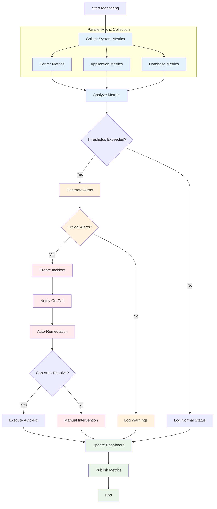
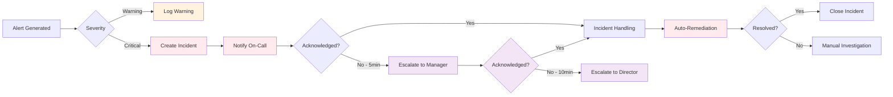
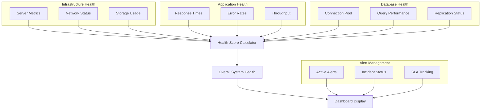

# System Monitoring and Alerting Workflow

This workflow demonstrates comprehensive system monitoring with automated alerting and incident response.

## Workflow YAML

```yaml
id: system-monitoring
namespace: monitoring.operations
description: "Comprehensive system monitoring with automated alerting and response"

inputs:
  - id: monitoring_scope
    type: STRING
    description: "Monitoring scope (critical, all, specific-service)"
    defaults: "critical"
  - id: alert_threshold_cpu
    type: FLOAT
    description: "CPU usage alert threshold (0-1)"
    defaults: 0.80
  - id: alert_threshold_memory
    type: FLOAT
    description: "Memory usage alert threshold (0-1)"
    defaults: 0.85
  - id: alert_threshold_disk
    type: FLOAT
    description: "Disk usage alert threshold (0-1)"
    defaults: 0.90

labels:
  team: "sre"
  component: "monitoring"
  criticality: "high"

tasks:
  - id: collect-system-metrics
    type: io.kestra.plugin.core.flow.Parallel
    description: "Collect metrics from all monitored systems"
    tasks:
      - id: collect-server-metrics
        type: io.kestra.plugin.core.flow.EachParallel
        value: '["web-01", "web-02", "api-01", "api-02", "db-01"]'
        tasks:
          - id: get-server-metrics
            type: io.kestra.plugin.core.debug.Return
            format: |
              {
                "server": "{{ taskrun.value }}",
                "timestamp": "{{ now() }}",
                "metrics": {
                  "cpu_usage": {{ random() * 0.9 | round(2) }},
                  "memory_usage": {{ random() * 0.8 | round(2) }},
                  "disk_usage": {{ random() * 0.7 | round(2) }},
                  "network_io": {{ (random() * 1000) | round }},
                  "response_time": {{ (random() * 200 + 50) | round }}
                },
                "status": "online"
              }
      
      - id: collect-application-metrics
        type: io.kestra.plugin.core.flow.EachParallel
        value: '["frontend", "user-service", "order-service", "payment-service"]'
        tasks:
          - id: get-app-metrics
            type: io.kestra.plugin.core.debug.Return
            format: |
              {
                "application": "{{ taskrun.value }}",
                "timestamp": "{{ now() }}",
                "metrics": {
                  "requests_per_second": {{ (random() * 500 + 100) | round }},
                  "error_rate": {{ random() * 0.05 | round(4) }},
                  "response_time_p95": {{ (random() * 300 + 100) | round }},
                  "active_connections": {{ (random() * 1000 + 200) | round }},
                  "queue_depth": {{ (random() * 50) | round }}
                },
                "health": "{{ random() > 0.1 ? 'healthy' : 'degraded' }}"
              }
      
      - id: collect-database-metrics
        type: io.kestra.plugin.core.debug.Return
        format: |
          {
            "database": "production-db",
            "timestamp": "{{ now() }}",
            "metrics": {
              "connection_count": {{ (random() * 100 + 50) | round }},
              "query_time_avg": {{ (random() * 100 + 10) | round }},
              "lock_waits": {{ (random() * 10) | round }},
              "buffer_hit_ratio": {{ (0.9 + random() * 0.09) | round(3) }},
              "replication_lag": {{ (random() * 5) | round }}
            },
            "status": "online"
          }

  - id: analyze-metrics
    type: io.kestra.plugin.core.flow.Sequential
    tasks:
      - id: check-server-health
        type: io.kestra.plugin.core.flow.ForEach
        values: "{{ outputs.get_server_metrics }}"
        tasks:
          - id: evaluate-server-alerts
            type: io.kestra.plugin.core.flow.If
            condition: |
              {{ 
                taskrun.value.metrics.cpu_usage > inputs.alert_threshold_cpu || 
                taskrun.value.metrics.memory_usage > inputs.alert_threshold_memory || 
                taskrun.value.metrics.disk_usage > inputs.alert_threshold_disk 
              }}
            then:
              - id: create-server-alert
                type: io.kestra.plugin.core.debug.Return
                format: |
                  {
                    "alert_type": "server_resource",
                    "severity": "{{ taskrun.value.metrics.cpu_usage > 0.95 || taskrun.value.metrics.memory_usage > 0.95 ? 'critical' : 'warning' }}",
                    "server": "{{ taskrun.value.server }}",
                    "metrics": {{ taskrun.value.metrics | json }},
                    "thresholds_exceeded": [
                      {{ taskrun.value.metrics.cpu_usage > inputs.alert_threshold_cpu ? '"cpu"' : '' }},
                      {{ taskrun.value.metrics.memory_usage > inputs.alert_threshold_memory ? '"memory"' : '' }},
                      {{ taskrun.value.metrics.disk_usage > inputs.alert_threshold_disk ? '"disk"' : '' }}
                    ],
                    "created_at": "{{ now() }}"
                  }
      
      - id: check-application-health
        type: io.kestra.plugin.core.flow.ForEach
        values: "{{ outputs.get_app_metrics }}"
        tasks:
          - id: evaluate-app-alerts
            type: io.kestra.plugin.core.flow.If
            condition: "{{ taskrun.value.metrics.error_rate > 0.01 || taskrun.value.metrics.response_time_p95 > 1000 }}"
            then:
              - id: create-app-alert
                type: io.kestra.plugin.core.debug.Return
                format: |
                  {
                    "alert_type": "application_performance",
                    "severity": "{{ taskrun.value.metrics.error_rate > 0.05 ? 'critical' : 'warning' }}",
                    "application": "{{ taskrun.value.application }}",
                    "error_rate": {{ taskrun.value.metrics.error_rate }},
                    "response_time": {{ taskrun.value.metrics.response_time_p95 }},
                    "health_status": "{{ taskrun.value.health }}",
                    "created_at": "{{ now() }}"
                  }
      
      - id: check-database-health
        type: io.kestra.plugin.core.flow.If
        condition: "{{ outputs.collect_database_metrics.metrics.replication_lag > 10 || outputs.collect_database_metrics.metrics.connection_count > 90 }}"
        then:
          - id: create-db-alert
            type: io.kestra.plugin.core.debug.Return
            format: |
              {
                "alert_type": "database_issue",
                "severity": "{{ outputs.collect_database_metrics.metrics.replication_lag > 30 ? 'critical' : 'warning' }}",
                "database": "{{ outputs.collect_database_metrics.database }}",
                "replication_lag": {{ outputs.collect_database_metrics.metrics.replication_lag }},
                "connection_count": {{ outputs.collect_database_metrics.metrics.connection_count }},
                "created_at": "{{ now() }}"
              }

  - id: aggregate-alerts
    type: io.kestra.plugin.core.debug.Return
    description: "Aggregate all generated alerts"
    format: |
      {
        "monitoring_run_id": "{{ execution.id }}",
        "timestamp": "{{ now() }}",
        "alerts_generated": [
          {{ outputs.create_server_alert ? outputs.create_server_alert : '' }},
          {{ outputs.create_app_alert ? outputs.create_app_alert : '' }},
          {{ outputs.create_db_alert ? outputs.create_db_alert : '' }}
        ],
        "total_alerts": {{ [outputs.create_server_alert, outputs.create_app_alert, outputs.create_db_alert] | filter(alert -> alert != null) | length }},
        "critical_alerts": {{ [outputs.create_server_alert, outputs.create_app_alert, outputs.create_db_alert] | filter(alert -> alert != null && alert.severity == 'critical') | length }}
      }

  - id: incident-response
    type: io.kestra.plugin.core.flow.If
    condition: "{{ outputs.aggregate_alerts.critical_alerts > 0 }}"
    then:
      - id: create-incident
        type: io.kestra.plugin.core.debug.Return
        format: |
          {
            "incident_id": "INC-{{ now() | date('yyyyMMdd-HHmmss') }}",
            "severity": "high",
            "status": "open",
            "title": "Critical System Alert - {{ outputs.aggregate_alerts.critical_alerts }} critical issues detected",
            "description": "Automated incident created due to critical system alerts",
            "alerts": {{ outputs.aggregate_alerts.alerts_generated | json }},
            "created_at": "{{ now() }}"
          }
      
      - id: notify-on-call
        type: io.kestra.plugin.core.debug.Return
        format: |
          {
            "notification_type": "pagerduty",
            "incident_id": "{{ outputs.create_incident.incident_id }}",
            "message": "🚨 CRITICAL: {{ outputs.aggregate_alerts.critical_alerts }} critical system alerts",
            "recipients": ["sre-oncall", "platform-team"],
            "escalation_policy": "critical-systems",
            "sent_at": "{{ now() }}"
          }
      
      - id: auto-remediation-check
        type: io.kestra.plugin.core.flow.Switch
        value: "{{ outputs.create_server_alert.alert_type ?? 'none' }}"
        cases:
          server_resource:
            - id: attempt-auto-scaling
              type: io.kestra.plugin.core.debug.Return
              format: |
                {
                  "action": "auto_scaling",
                  "server": "{{ outputs.create_server_alert.server }}",
                  "scaling_action": "scale_up",
                  "target_capacity": "+20%",
                  "initiated_at": "{{ now() }}"
                }
        defaults:
          - id: manual-intervention-required
            type: io.kestra.plugin.core.log.Log
            message: "Manual intervention required for incident {{ outputs.create_incident.incident_id }}"
            level: WARN
    else:
      - id: routine-monitoring-complete
        type: io.kestra.plugin.core.log.Log
        message: "Monitoring complete - no critical alerts generated"
        level: INFO

  - id: update-monitoring-dashboard
    type: io.kestra.plugin.core.debug.Return
    description: "Update monitoring dashboard with latest metrics"
    format: |
      {
        "dashboard_update": {
          "timestamp": "{{ now() }}",
          "servers_monitored": {{ outputs.get_server_metrics | length }},
          "applications_monitored": {{ outputs.get_app_metrics | length }},
          "total_alerts": {{ outputs.aggregate_alerts.total_alerts }},
          "system_health": "{{ outputs.aggregate_alerts.critical_alerts == 0 ? 'healthy' : 'degraded' }}",
          "last_incident": "{{ outputs.create_incident.incident_id ?? 'none' }}"
        }
      }

  - id: publish-monitoring-metrics
    type: io.kestra.plugin.core.metric.Publish
    description: "Publish monitoring metrics to observability platform"
    metrics:
      - name: "monitoring_execution_duration"
        type: "timer"
        value: "{{ execution.state.duration.toMillis() }}"
        tags:
          scope: "{{ inputs.monitoring_scope }}"
      - name: "alerts_generated"
        type: "counter"
        value: "{{ outputs.aggregate_alerts.total_alerts }}"
        tags:
          severity: "all"
      - name: "critical_alerts"
        type: "counter"
        value: "{{ outputs.aggregate_alerts.critical_alerts }}"
        tags:
          severity: "critical"
      - name: "system_health_score"
        type: "gauge"
        value: "{{ outputs.aggregate_alerts.critical_alerts == 0 ? 100 : (100 - outputs.aggregate_alerts.critical_alerts * 10) }}"

errors:
  - id: monitoring-failure-handler
    type: io.kestra.plugin.core.flow.Sequential
    tasks:
      - id: log-monitoring-failure
        type: io.kestra.plugin.core.log.Log
        message: "Monitoring workflow failed: {{ error.message }}"
        level: ERROR
      
      - id: create-monitoring-alert
        type: io.kestra.plugin.core.debug.Return
        format: |
          {
            "alert_type": "monitoring_system_failure",
            "severity": "critical",
            "message": "Monitoring system itself has failed",
            "error": "{{ error.message }}",
            "created_at": "{{ now() }}"
          }
      
      - id: notify-sre-team
        type: io.kestra.plugin.core.debug.Return
        format: "🚨 URGENT: Monitoring system failure - manual investigation required"

triggers:
  - id: continuous-monitoring
    type: io.kestra.plugin.core.trigger.Schedule
    cron: "*/5 * * * *"  # Every 5 minutes
    inputs:
      monitoring_scope: "critical"
      alert_threshold_cpu: 0.85
      alert_threshold_memory: 0.90
      alert_threshold_disk: 0.95

listeners:
  - conditions:
      - type: io.kestra.plugin.core.condition.ExecutionStatus
        in: [SUCCESS]
      - type: io.kestra.plugin.core.condition.ExecutionOutputs
        expression: "{{ outputs.aggregate_alerts.critical_alerts > 0 }}"
    tasks:
      - id: escalate-critical-alerts
        type: io.kestra.plugin.core.flow.If
        condition: "{{ outputs.aggregate_alerts.critical_alerts >= 3 }}"
        then:
          - id: major-incident-declaration
            type: io.kestra.plugin.core.debug.Return
            format: "🚨 MAJOR INCIDENT: Multiple critical alerts detected - escalating to incident commander"
  
  - conditions:
      - type: io.kestra.plugin.core.condition.ExecutionStatus
        in: [FAILED]
    tasks:
      - id: monitoring-failure-escalation
        type: io.kestra.plugin.core.debug.Return
        format: "Escalating monitoring system failure to SRE leadership"
```

## Monitoring Flow Diagram



## Alert Escalation Flow



## System Health Dashboard



## Key Features

1. **Comprehensive Monitoring**: Servers, applications, and databases
2. **Intelligent Alerting**: Threshold-based alerts with severity levels
3. **Automated Response**: Auto-remediation for common issues
4. **Incident Management**: Automatic incident creation and escalation
5. **Real-time Dashboard**: Live system health visualization
6. **Metrics Publishing**: Integration with observability platforms
7. **Escalation Policies**: Multi-level notification system

## Use Cases

- **Infrastructure Monitoring**: Server health and resource utilization
- **Application Performance**: Response times, error rates, throughput
- **Database Monitoring**: Connection pools, query performance, replication
- **Incident Response**: Automated incident creation and escalation
- **SLA Tracking**: Service level agreement monitoring and reporting
- **Capacity Planning**: Resource usage trends and forecasting